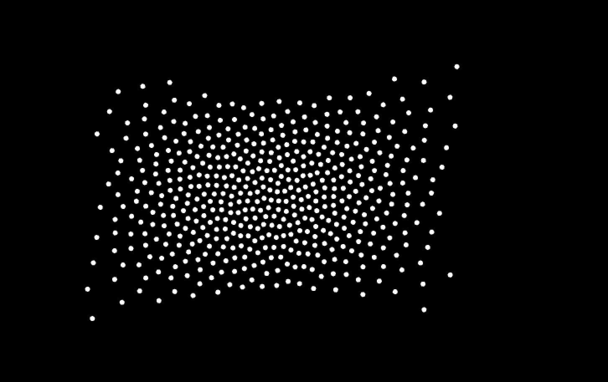
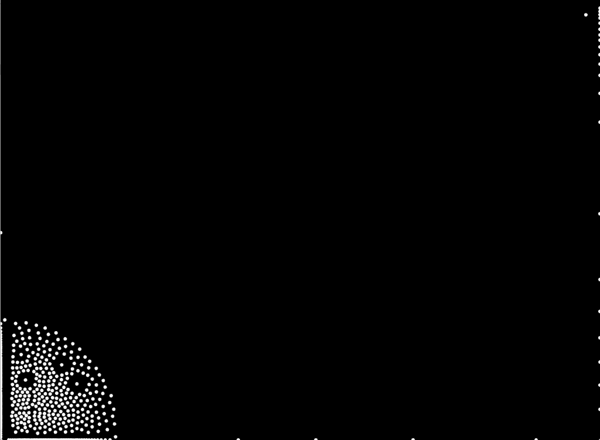
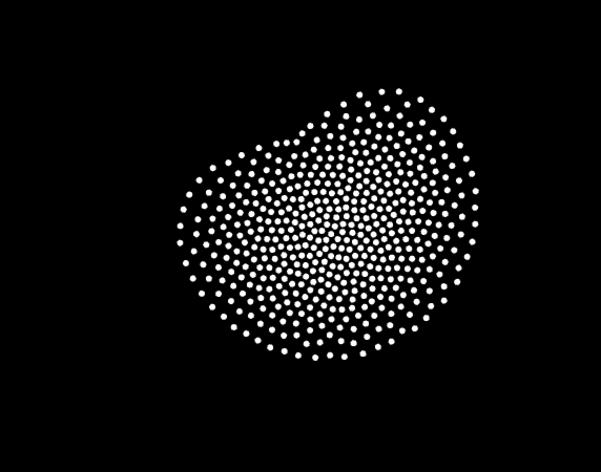

##Project 3
 
 
 
 
 
 
 project 3 takes attraction from which can be multipulied by the mouse direction.
 the class can by pulled and played with,I was hoping to connect to phyiscal computing project    that sense the pressure and seperate the particles 
 